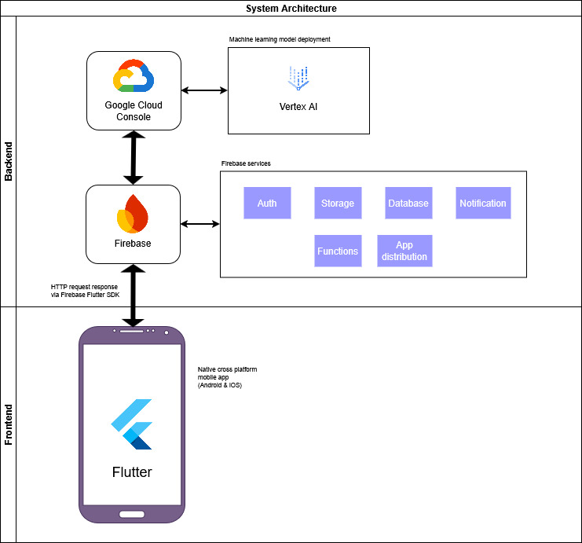

# Rukun.in App

## System Architecture

## App Demo

This app is designed to work seamlessly across platforms, especially on native Android and the web, by leveraging the full capabilities of the Flutter framework.  
You can access our web app for a quick and easy demonstration:

👉🏻 https://rukunin-app.web.app/

Below are demo user accounts you can use to sign in:

| No. | Role | Email | Password |
| --- | --- | --- | --- |
| 1. | Admin | admin@rukunin.app | admin123 |
| 2. | Ketua RW | ketuarw@rukunin.app | ketuarw123 |
| 3. | Ketua RT | ketuart@rukunin.app | ketuart123 |
| 4. | Secretary | sekretaris@rukunin.app | sekretaris123 |
| 5. | Treasurer | bendahara@rukunin.app | bendahara123 |
| 6. | Warga | warga@rukunin.app | warga123 |